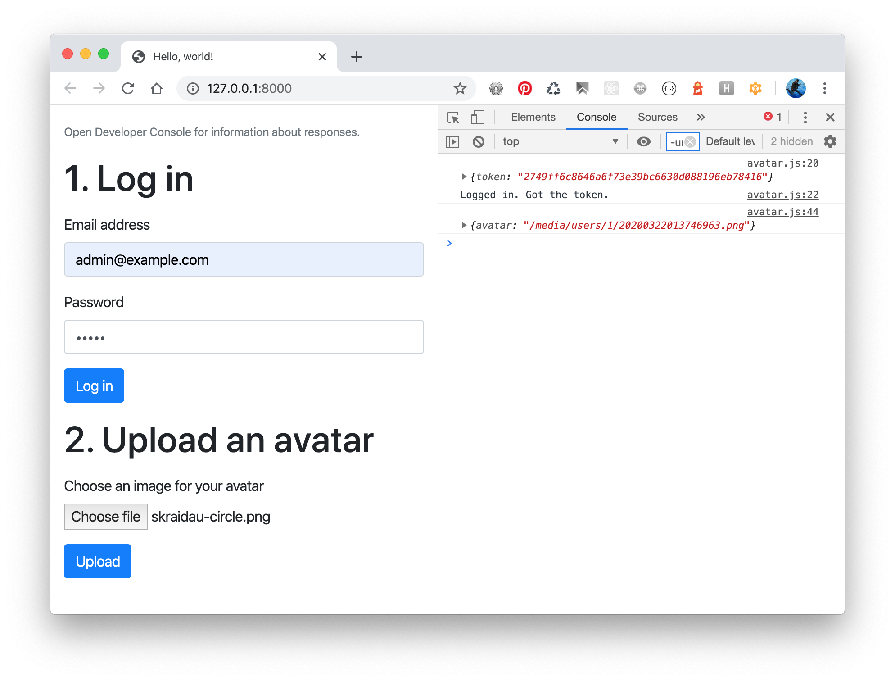

# Experiment with Django REST Framework and Image Uploads

To check image upload via REST API, perform these steps:

1. Download the code.
2. Create a virtual environment with Python 3.
3. Install the pip requirements from requirements.txt.
4. Migrate the database.
5. Create the superuser.
4. Run the local development server.
5. Visit `http://127.0.0.1:8000` and try out the forms.

This is how it looks there:

Read more about file uploads using Django REST Framework at the [DjangoTricks blog](https://djangotricks.blogspot.com/2020/03/how-to-upload-a-file-using-django-rest-framework.html).
